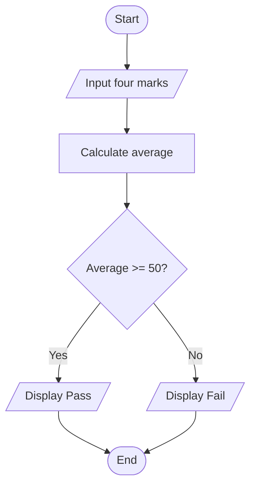

# Topic 5: Logic Building — Algorithms, Pseudocode & Flowcharts

Before writing C code, plan how the program should solve the problem. Three useful planning tools are algorithms, pseudocode, and flowcharts.

## Algorithm

An algorithm is a finite, clear sequence of steps that transforms input into an output.

A good algorithm has:

- **Finiteness:** It eventually ends.
- **Definiteness:** Each step is precise.
- **Input:** It accepts zero or more inputs.
- **Output:** It produces a result.
- **Effectiveness:** Each step can actually be performed.

### Example: average of three numbers

1. Start.
2. Read `a`, `b`, and `c`.
3. Calculate `average = (a + b + c) / 3.0`.
4. Display the average.
5. End.

## Pseudocode

Pseudocode expresses logic in plain language without requiring exact C syntax. It lets you focus on the solution before thinking about semicolons, types, and library functions.

```text
START
    INPUT four marks
    average = sum of marks / 4
    IF average >= 50 THEN
        OUTPUT "Pass"
    ELSE
        OUTPUT "Fail"
    END IF
END
```

## Flowcharts

A flowchart represents an algorithm visually. Common symbols include:

| Symbol | Purpose |
| --- | --- |
| Oval | Start or end |
| Parallelogram | Input or output |
| Rectangle | Processing or calculation |
| Diamond | Decision |
| Arrow | Direction of flow |

### Example: check pass or fail



## Practice

1. Write an algorithm to find the larger of two numbers.
2. Convert that algorithm into pseudocode.
3. Draw a flowchart for checking whether a number is even or odd.

## Key takeaway

Planning separates problem-solving from language syntax. A clear algorithm makes the final C program easier to write, test, and debug.

---

[⬅️ Previous topic: Advantages & Disadvantages](./04-advantages-disadvantages.md) | [➡️ Next topic: Compiler Setup](./06-compiler-setup.md)
