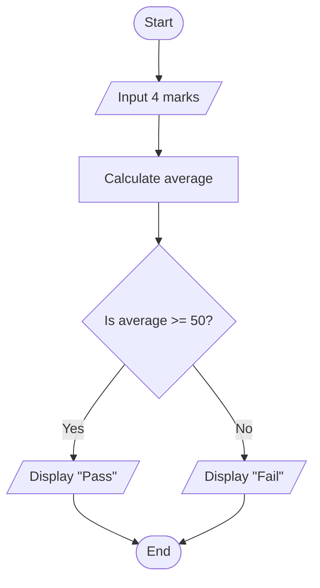

# 🧠 Logic Building in C

> Learn how to plan a solution before writing C code.


Logic building is the process of breaking a problem into small, clear steps. Before writing code, we must first decide:

- What input is needed?
- What should the program do?
- What decision is required?
- What should be displayed as output?

---

## 🎯 What You Will Learn

By the end of this topic, you will be able to:

- ✅ Explain what an algorithm is
- ✅ Write simple pseudocode
- ✅ Understand common flowchart symbols
- ✅ Identify input, processing, decision, and output
- ✅ Understand how conditions change program flow
- ✅ Plan a solution before writing C code

---

## 1️⃣ Algorithm

> 📌 An algorithm is a step-by-step plan for solving a problem.

### In simple words

An algorithm tells the computer:

1. What to do first
2. What to do next
3. When to make a decision
4. When the solution is complete

An algorithm must have:

- Finiteness – It must end after a fixed number of steps.
- Definiteness – Every step must be clear and exact.
- Input – It can take zero or more inputs.
- Output – It must produce at least one output.
- Effectiveness – Every step must be simple enough to carry out.

### Example: Find the average of three numbers

> * Start
> * Read three numbers and store them in a, b, c
> * Compute avg = (a + b + c) / 3.0
> * Display the average
> * End

**Why is this useful?**

Because it helps us think clearly before coding. It reduces mistakes and makes the program easier to build.

---

## 2️⃣ Pseudocode

> 📌 Pseudocode is a simple way to write the logic of a program using everyday language instead of real C syntax.

### In simple words

Pseudocode helps us plan the program before writing actual code. It is easier to understand and edit than full C code.

### Example: Check pass/fail based on average marks

> * Input 4 marks
> * Calculate their average by summing and dividing by 4
> * If average is below 50
> * print "Fail"
> * else
> * print "Pass"

**Why is this useful?**

It gives a clear sequence of actions before the real program is written.

---

## 3️⃣ Flowchart

> 📌 A flowchart is a visual diagram that shows the steps of an algorithm in order.

### Why flowcharts are useful

- They make logic easy to understand at a glance.
- They help us plan programs before coding.
- They show what happens step by step.
- They make decision points easy to see.

### Standard flowchart symbols

| Symbol Name | Actual Visual Shape | Purpose / Description |
| :--- | :---: | :--- |
| **Flow Lines** | ➡️ ⬇️ | Connect symbols and show the direction of flow. |
| **Terminal Symbol** | 🛑 *(Oval)* | Indicates the **Start** or **End** of a flowchart. |
| **Input / Output** | ▰ *(Parallelogram)* | Used for reading inputs or displaying outputs. |
| **Process Symbol** | ▭ *(Rectangle)* | Used for calculations and operations. |
| **Decision Symbol** | 🔷 *(Diamond)* | Represents a true/false or yes/no question. |
| **Connectors** | ⚪ *(Circle)* | Connects different parts of a long flowchart. |

### How to choose the correct symbol

- 📥 Reading data → Parallelogram
- ⚙️ Calculating or processing → Rectangle
- ❓ Asking a question → Diamond
- 📤 Displaying results → Parallelogram
- 🟢 Starting or ending → Oval

### Example Flowchart: Check Pass or Fail

This flowchart checks whether a student's average marks are enough to pass.



### What do these shapes mean here?

- `Start` and `End` use terminal symbols.
- `Input 4 marks` uses a parallelogram because it is an input operation.
- `Calculate average` uses a rectangle because it is a processing step.
- `Is average >= 50?` uses a diamond because it is a decision.
- `Display "Pass"` and `Display "Fail"` use parallelograms because they are output operations.

---

## 🔍 Conditions and Comparison Operators

A condition is a question whose answer is either **true** or **false**.

| Operator | Meaning | Example |
| :---: | :--- | :--- |
| `>` | Greater than | `average > 50` |
| `<` | Less than | `average < 50` |
| `>=` | Greater than or equal to | `average >= 50` |
| `<=` | Less than or equal to | `average <= 50` |
| `==` | Equal to | `average == 50` |
| `!=` | Not equal to | `average != 50` |

### Example

```c
average >= 50
```

- If the condition is **true**, the program follows the **Pass** path.
- If the condition is **false**, the program follows the **Fail** path.

> ⚠️ Important:
>
> - `=` is used to assign a value.
> - `==` is used to compare two values.
>
> `average = 50` means: store 50 in average.
>
> `average == 50` means: check whether average is equal to 50.

---

## 🧠 What if We Use More Than One Condition?

Sometimes a program needs more than one condition. We can combine conditions using logical operators.

| Operator | Meaning | Example |
| :---: | :--- | :--- |
| `&&` | AND — both conditions must be true | `marks >= 50 && attendance >= 75` |
| `||` | OR — at least one condition must be true | `day == 6 || day == 7` |
| `!` | NOT — reverses the result | `!(average >= 50)` |

### Example

```c
marks >= 50 && attendance >= 75
```

This condition is true only when both conditions are true.

---

## 🧩 Remember This Pattern

Most beginner programs follow this basic structure:

```text
Input → Process → Decision ��� Output
```

Example:

```text
Enter marks → Calculate average → Check pass/fail → Display result
```

Planning this flow before coding helps you write programs with fewer mistakes.

---

## 💡 Quick Check

Before writing a program, ask yourself:

- What information does the user enter?
- What calculation or processing is needed?
- Is a decision required?
- What result should be displayed?

If you can answer these questions, you are already building the logic correctly.

---

<div align="left">
  <a href="./04-advantages-disadvantages.md">⬅️ Previous Topic: Advantages and Disadvantages</a>
</div>

<div align="right">
  <a href="./06-compiler-setup.md">Next Topic: Compiler setup ➡️</a>
</div>
